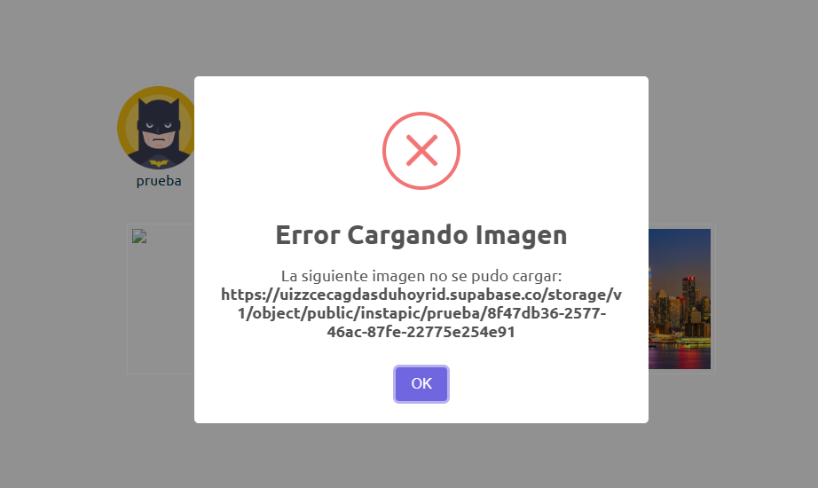

# Desarrollo Web - Retos
# Retos realizados en la materia Desarrollo de aplicaciones web - Sebastián Tamayo Avendaño.

En este reto debiamos añadir Swal en el home para que que se visualizara errores tras la carga fallida de una imagen, entonces se modifico home.html para que envie el evento cuando sucede (error), lo enviamos a onImageError en home.ts para verificar cual URL fallo en la carga de imagenes.

